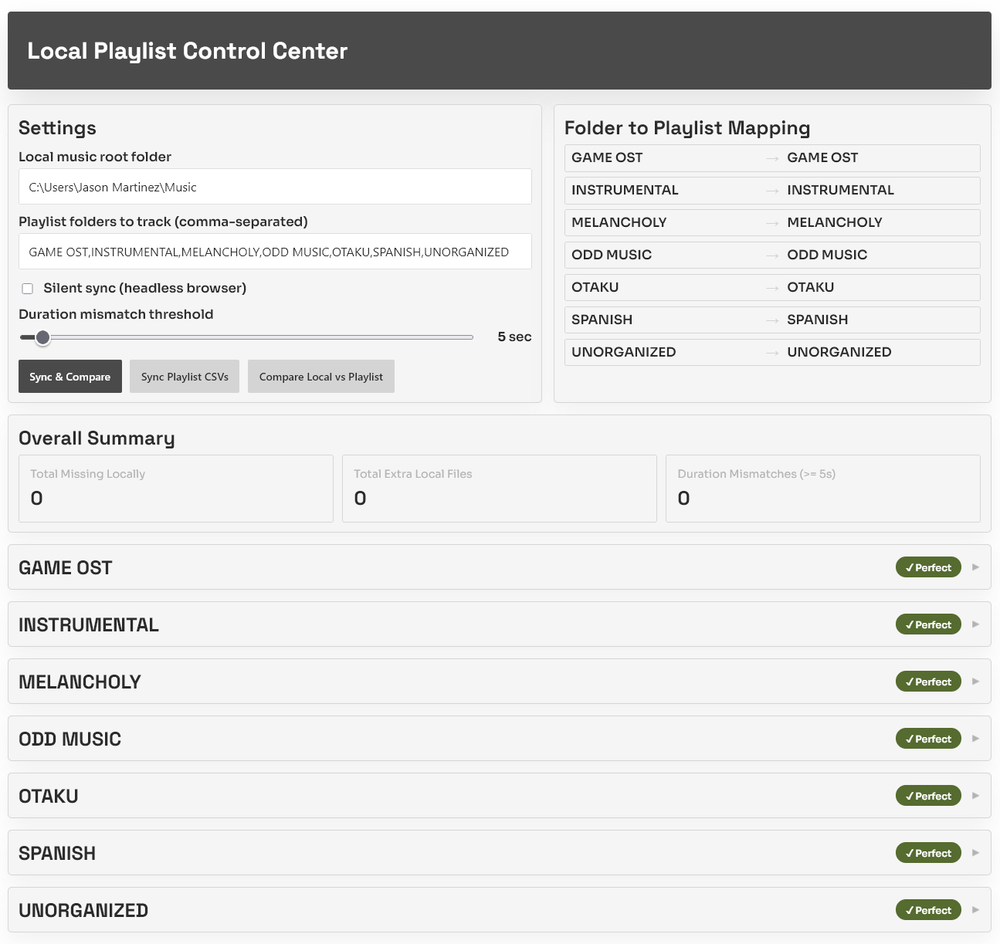

# Local Playlist Checker

Compares local downloaded music folders against Spotify playlists — without using the Spotify API directly. It drives [Exportify](https://github.com/pavelkomarov/exportify) in a browser session to download playlist CSVs, then shows a dashboard with:

- Songs missing locally (in playlist but not in folder)
- Extra local songs (in folder but not in playlist)
- Large duration mismatches between local files and Spotify tracks
- Download missing tracks directly using [SpotiFLAC](https://github.com/ShuShuzinhuu/SpotiFLAC-Module-Version)
- Delete extra local files from the dashboard



## Project Structure

```
local-playlist-checker/
├── app/                        # Application package
│   ├── __init__.py             # Flask app factory
│   ├── config.py               # Constants + config load/save
│   ├── models.py               # Track dataclass
│   ├── utils.py                # String/format helpers
│   ├── scanner.py              # Local file scanning
│   ├── exportify.py            # Exportify CSV + Playwright automation
│   ├── comparator.py           # Track comparison logic
│   ├── downloader.py           # SpotiFLAC background jobs
│   └── routes/
│       ├── main.py             # / and /health routes
│       └── api.py              # /download, /download_status, /delete routes
├── config/
│   └── playlist-checker-config.json  # Saved settings (gitignored)
├── frontend/
│   ├── static/style.css
│   └── templates/index.html
├── scripts/
│   ├── run.bat                 # Launch web UI (Windows)
│   ├── run.sh                  # Launch web UI (Linux/macOS)
│   ├── sync_playlists.py       # Standalone CLI syncer
│   └── sync_hidden.bat         # Silent background sync (Windows)
├── exports/                    # Downloaded Exportify CSVs (gitignored)
├── logs/                       # Sync logs (gitignored)
└── run.py                      # Entry point
```

## Why this avoids API usage

- The app does not call the Spotify Web API itself.
- It drives Exportify in your browser and uses CSV exports as the source of truth.

## Requirements

- Python 3.10+
- A local music root folder containing subfolders that match playlist names
- Internet access to open Exportify and sign in once

## Setup

1. Create and activate a virtual environment:

```bash
python -m venv .venv

# Windows
.venv\Scripts\activate

# Linux / macOS
source .venv/bin/activate
```

2. Install dependencies:

```bash
pip install -r requirements.txt
```

3. Install Playwright's Chromium browser:

```bash
playwright install chromium
```

## Running the web dashboard

```bash
python run.py
```

Or use the platform scripts (they activate the venv automatically):

```bash
# Windows
scripts\run.bat

# Linux / macOS
bash scripts/run.sh
```

For Ubuntu server usage with debug disabled:

```bash
chmod +x scripts/run_server_ubuntu.sh
./scripts/run_server_ubuntu.sh
```

Open `http://localhost:5301` in your browser.

## Using the dashboard

1. Set your local **music root folder**.
2. Folders inside that root are auto-discovered. Select the ones to track (or add them manually as a comma-separated list).
3. Optionally set name overrides in `folder=playlist` format if a folder name doesn't match its playlist name.
4. Enable **Silent sync (headless browser)** to skip the visible browser window.
5. Click **Sync Playlist CSVs from Exportify** to download fresh CSVs.
   - On first run with silent mode off, a Chromium window opens — sign in to Spotify if prompted and wait for playlists to load. Auth is saved locally so subsequent silent syncs don't need login.
6. Click **Compare Local vs Playlist** to see results.
7. Review missing and extra tracks per playlist. Download or delete files directly from the dashboard.

Settings are saved automatically to `config/playlist-checker-config.json` and persist between runs.

## Standalone sync (no UI)

Sync playlist CSVs from the command line without starting the web server:

```bash
# Headless (uses saved settings)
python scripts/sync_playlists.py

# With a visible browser (e.g. if Spotify login is needed)
python scripts/sync_playlists.py --visible
```

Results are always written to `logs/sync.log`.

### Silent background sync on Windows

```bash
scripts\sync_hidden.bat
```

Runs entirely hidden with no console window — suitable for Task Scheduler automation. Check `logs/sync.log` for results.

## Notes and limitations

- Filename parsing is best-effort. Files named `Artist - Song.mp3` match most accurately.
- If your naming style differs, comparison falls back to title-only matching.
- CSV exports are stored in `exports/` by default.
- For first-time login, run one non-silent sync so Spotify auth is saved in the Exportify browser profile, then silent mode works without a visible browser.